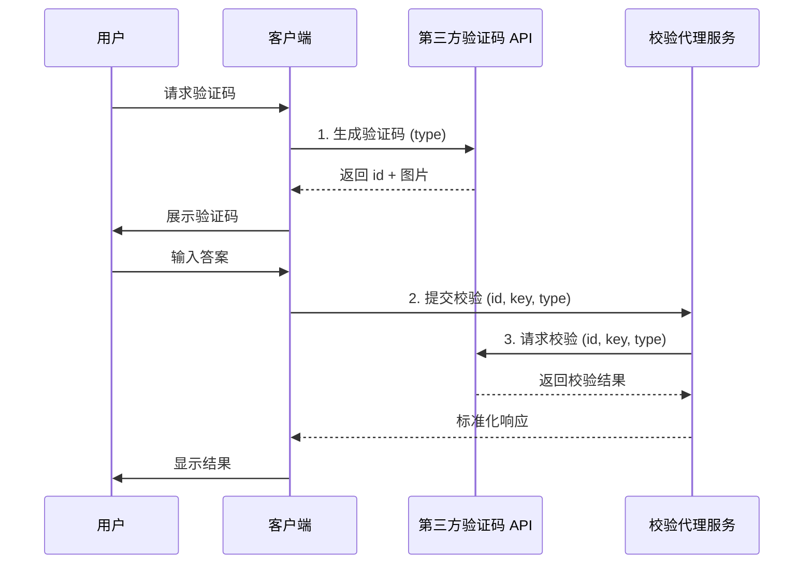

# 验证码校验通用架构说明

## 概述

本文档面向任何语言/技术栈的开发团队，描述一种"客户端直连获取验证码、网关代理校验"的通用架构模式。此架构的核心价值在于：
- **降低服务端压力**：验证码生成与图片渲染由第三方承担，自建服务只负责轻量级校验。
- **增强安全控制**：集中在网关层实施鉴权、审计、限流等策略。
- **技术栈无关**：客户端和服务端可自由选择语言与框架，只需遵循统一的交互契约。

## 核心设计原则

1. **职责分离**：客户端负责展示，网关负责校验，第三方负责生成，三者解耦。
2. **最小化信任**：客户端直接获取验证码，但校验权限由网关控制，防止绕过。
3. **标准化接口**：统一请求/响应格式，便于跨平台集成与替换服务提供商。

## 总体流程



### 流程说明

1. **生成阶段**：客户端直接调用第三方 API 获取验证码图片与唯一标识 ID.
2. **提交阶段**：用户输入验证码后，客户端将 `id + key + type` 提交给自建网关.
3. **校验阶段**：网关携带参数请求第三方 API 进行校验，并返回标准化结果给客户端.

## 角色职责（可对应任意实现）

### 1. 客户端（Client）

**技术实现**：Web 前端、移动端 App、桌面应用、小程序等.

**核心职责**：
- 直接渲染第三方提供的验证码图片或 Base64 数据.
- 收集用户输入，携带 `id/key/type` 提交至网关校验.
- 处理校验结果并向用户反馈（成功/失败/刷新）。

**技术要求**：
- 支持 HTTP/HTTPS 请求.
- 安全存储网关地址等配置信息.
- 实现基本的错误处理与重试机制.

### 2. 校验代理服务（Gateway）

**技术实现**：后端服务，可使用任意 Web 框架（如 RESTful API、GraphQL、RPC 等）。

**核心职责**：
- 接收客户端提交的校验请求（`id/key/type`）。
- 向第三方 API 发起校验请求，统一处理成功/失败/异常并返回标准响应.
- 实施安全控制：鉴权、限流、审计、日志.

**技术要求**：
- HTTP 客户端能力（超时、重试、错误处理）。
- 配置管理（第三方 URL、密钥、限流等）。
- 安全控制（鉴权、日志、审计）。
- 支持标准化的请求/响应格式.

### 3. 第三方验证码服务（Provider）

**提供方**：当前使用 `https://v2.xxapi.cn/api/captcha`，可替换为其他符合契约的服务.

**核心职责**：
- 负责生成验证码、返回 ID 与图片资源，并提供校验接口.
- 维护验证码有效期（通常 2-5 分钟）。
- 提供统一的成功/失败响应格式.

## 第三方验证码 API 说明

本节描述当前采用的第三方 API 契约。若替换服务商，需确保新服务提供等价的接口能力。

### 本项目运行时配置

项目通过运行时 TOML 的 `[captcha]` 和 `[verification]` 控制验证码链路，前端不再硬编码第三方验证码地址、类型、尺寸、难度或 QQ 验证码长度。非敏感参数会由 `GET /api/public-config` 返回给前端。

```toml
[captcha]
api_url = "https://v2.xxapi.cn/api/captcha"
request_timeout_seconds = 5
token_expire_seconds = 60
captcha_type = "math"
width = 300
height = 100
options = 2

[verification]
code_length = 6
expire_seconds = 300
redis_key_prefix = "verify"
```

- `captcha.api_url`、`captcha.captcha_type`、`captcha.width`、`captcha.height`、`captcha.options` 控制前端向第三方生成验证码时携带的参数。
- `captcha.request_timeout_seconds` 控制前端生成请求和后端代理校验请求的超时时间。
- `captcha.token_expire_seconds` 控制网关校验成功后签发的一次性 `captcha_token` 的有效期；该 token 只用于随后调用 `/api/auth/send-verification-code`。
- `verification.code_length` 和 `verification.expire_seconds` 控制 QQ 登录验证码的长度与 Redis 有效期。

### 操作 1：生成验证码（客户端调用）

- **请求方式**：GET
- **接口地址**：`https://v2.xxapi.cn/api/captcha`
- **接口描述**：提供文字、数字、算数验证码，2 分钟有效，适用于注册/登录/验证场景。
- **调用方**：客户端直接请求

#### 请求参数

| 参数名 | 类型 | 传入位置 | 必填 | 参数说明 |
|--------|------|----------|------|----------|
| type | string | query | 是 | `string` 字符、`math` 算数、`digit` 数字 |
| width | number | query | 否 | 验证码宽度，默认 280px |
| height | number | query | 否 | 验证码高度，默认 80px |
| length | number | query | 否 | 字符验证码长度，默认 6 |
| options | 1/2/3 | query | 否 | 难度等级，默认 2 |

#### 返回示例（生成成功）

```json
{
  "code": 200,
  "msg": "数据请求成功",
  "data": {
    "id": "vURyZ0UzjjMckUD8ZBCV",
    "url": "data:image/png;base64,iVBORw0KG...."
  }
}
```

### 操作 2：校验验证码（网关调用）

- **请求方式**：GET
- **接口地址**：`https://v2.xxapi.cn/api/captcha`
- **接口描述**：校验用户输入的验证码是否正确。
- **调用方**：网关代理服务

#### 请求参数

| 参数名 | 类型 | 传入位置 | 必填 | 参数说明 |
|--------|------|----------|------|----------|
| id | string | query | 是 | 验证码生成时返回的唯一 ID |
| key | string | query | 是 | 用户输入的验证码答案 |
| type | string | query | 是 | 验证码类型（需与生成时一致） |

#### 返回示例

**校验成功**
```json
{
  "code": 200,
  "msg": "数据请求成功",
  "data": "验证成功"
}
```

**校验失败**
```json
{
  "code": -2,
  "msg": "验证失败",
  "data": ""
}
```

## 网关标准化响应建议

网关向客户端返回的响应应统一格式，便于客户端统一处理。建议格式示例：

**校验成功**
```json
{
  "success": true,
  "message": "验证通过",
  "code": "VERIFY_SUCCESS"
}
```

**校验失败**
```json
{
  "success": false,
  "message": "验证码错误或已过期",
  "code": "VERIFY_FAILED"
}
```

**服务异常**
```json
{
  "success": false,
  "message": "验证服务暂时不可用",
  "code": "SERVICE_UNAVAILABLE"
}
```

# 扩展与落地建议

## 1. 缓存层

**目标**：降低重复校验、缓解高并发。

**实践**：
- 在网关使用内存缓存或分布式缓存（如 Redis/Memcached）缓存 `captcha_id` 的校验结果。
- TTL 设置为第三方有效期（如 2 分钟）。
- 失败后立即作废缓存记录，防止重放攻击。
- 成功后可选择立即失效或标记为"已使用"，避免同一验证码多次使用。

## 2. 鉴权与风控

**目标**：控制第三方 API 配额、防止滥用。

**实践**：
1. 网关实施身份验证（令牌、会话、签名等）。
2. 实施 IP / 用户级限流（令牌桶、漏桶、滑动窗口等算法）。
3. 记录请求日志，便于审计与报警。
4. 对异常流量（如单 IP 高频请求）进行拦截或降级。

---

## 总结

本架构通过职责分离与标准化接口，实现了：
- **跨语言可复现**：任何技术栈均可按此模式实施。
- **灵活可扩展**：可轻松集成缓存、鉴权、监控等功能。
- **降低成本**：验证码生成由第三方承担，自建服务仅需轻量级校验。

团队可基于此文档快速落地验证码校验功能，并根据业务需求逐步完善安全与性能策略.
